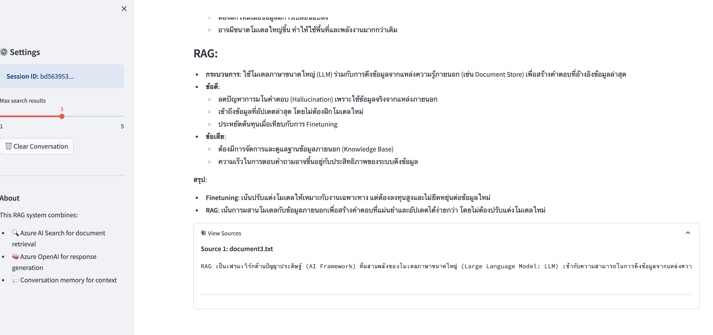

# Azure RAG System



A simple Retrieval Augmented Generation (RAG) system using Azure AI Search and Azure OpenAI Service.

## 🏗️ Architecture

This project implements a basic RAG pipeline with the following components:

- **Data Ingestion** (`src/ingestion/`): Scripts to ingest documents into Azure AI Search
- **Backend API** (`src/BE/`): FastAPI service with query endpoint and conversation memory
- **Frontend** (`src/FE/`): Streamlit web interface for Q&A
- **Mock Data** (`src/Data/`): Sample documents for testing

For a detailed architecture overview, see [ARCHITECTURE.md](ARCHITECTURE.md).

## 📋 Prerequisites

- Python 3.8+
- Azure subscription with:
  - Azure AI Search service
  - Azure OpenAI service with deployed models (GPT-3.5/GPT-4 and text-embedding-ada-002)

## 🚀 Quick Start

### 1. Clone the Repository

```bash
git clone <repository-url>
cd msft-basic-rag
```

### 2. Install Dependencies

```bash
pip install -r requirements.txt
```

### 3. Configure Environment Variables

Copy the example environment file and fill in your Azure credentials:

```bash
cp .env.example .env
```

Edit `.env` file with your Azure credentials:

```env
# Azure AI Search Configuration
AZURE_SEARCH_ENDPOINT=https://your-search-service.search.windows.net
AZURE_SEARCH_KEY=your-search-api-key
AZURE_SEARCH_INDEX_NAME=documents-index

# Azure OpenAI Configuration
AZURE_OPENAI_ENDPOINT=https://your-openai.openai.azure.com/
AZURE_OPENAI_KEY=your-openai-api-key
AZURE_OPENAI_DEPLOYMENT_NAME=gpt-35-turbo
AZURE_OPENAI_EMBEDDING_DEPLOYMENT_NAME=text-embedding-ada-002
AZURE_OPENAI_API_VERSION=2023-05-15

# Backend Configuration
BACKEND_HOST=localhost
BACKEND_PORT=8000
```

### 4. Run the Application

#### Option A: Using Quick Start Scripts (Recommended)

**On Linux/Mac:**
```bash
./start.sh
```

**On Windows:**
```batch
start.bat
```

The script will guide you through:
- Creating a virtual environment
- Installing dependencies
- Running data ingestion
- Starting the backend and frontend

#### Option B: Manual Setup

**Step 1: Ingest Data**

Run the ingestion script to load documents into Azure AI Search:

```bash
python src/ingestion/ingest.py
```

**Step 2: Start the Backend**

In one terminal, start the FastAPI backend:

```bash
python src/BE/main.py
```

Or using uvicorn directly:

```bash
uvicorn src.BE.main:app --reload --host 0.0.0.0 --port 8000
```

**Step 3: Start the Frontend**

In another terminal, start the Streamlit frontend:

```bash
streamlit run src/FE/app.py
```

### 5. Access the Application

- Frontend UI: http://localhost:8501
- Backend API: http://localhost:8000
- API Documentation: http://localhost:8000/docs

## 📁 Project Structure

```
msft-basic-rag/
├── src/
│   ├── ingestion/          # Data ingestion scripts
│   │   └── ingest.py       # Script to load documents into Azure AI Search
│   ├── BE/                 # Backend API
│   │   └── main.py         # FastAPI application with query endpoint
│   ├── FE/                 # Frontend UI
│   │   └── app.py          # Streamlit application
│   └── Data/               # Mock documents
│       ├── document1.txt   # Sample document about Azure AI Search
│       ├── document2.txt   # Sample document about Azure OpenAI
│       └── document3.txt   # Sample document about RAG
├── requirements.txt        # Python dependencies
├── test_backend.py         # Backend API test suite
├── start.sh               # Quick start script for Linux/Mac
├── start.bat              # Quick start script for Windows
├── .env.example           # Example environment configuration
├── .gitignore            # Git ignore file
├── CONTRIBUTING.md       # Development guidelines
└── README.md             # This file
```

## 🔧 Features

### Backend (FastAPI)

- **POST /query**: Main endpoint for querying the RAG system
  - Retrieves relevant documents from Azure AI Search
  - Generates answers using Azure OpenAI
  - Maintains conversation memory per session
- **GET /**: Health check endpoint
- **DELETE /conversation/{session_id}**: Clear conversation history
- **GET /conversation/{session_id}**: Get conversation history

### Frontend (Streamlit)

- Simple chat interface for asking questions
- Displays sources used to generate answers
- Conversation memory across multiple queries
- Clear conversation button
- Configurable search parameters

### Data Ingestion

- Reads documents from `src/Data/` folder
- Creates Azure AI Search index automatically
- Uploads documents to the index

## 🧪 Testing the System

### Quick Test

After starting the backend, you can verify it's working by running:

```bash
python test_backend.py
```

This will test:
- Health check endpoint
- Query endpoint
- Conversation management endpoints

### Manual Testing

1. After starting both backend and frontend, open http://localhost:8501
2. Try asking questions like:
   - "What is Azure AI Search?"
   - "Tell me about Azure OpenAI Service"
   - "How does RAG work?"
   - "What are the benefits of using RAG?"

## 🔒 Security Notes

- Never commit your `.env` file with actual credentials
- Use Azure Key Vault for production deployments
- Implement proper authentication for the API in production
- Enable HTTPS for all production endpoints

## 📝 Adding Your Own Documents

1. Place your text documents in the `src/Data/` folder
2. Run the ingestion script: `python src/ingestion/ingest.py`
3. Your documents will be indexed and available for querying

## 🛠️ Troubleshooting

**Backend won't start:**
- Verify all environment variables are set correctly in `.env`
- Check that Azure services are accessible
- Ensure no other service is using port 8000

**Frontend shows connection error:**
- Make sure the backend is running on port 8000
- Check that BACKEND_HOST and BACKEND_PORT in `.env` are correct

**No results from queries:**
- Verify documents were ingested successfully
- Check Azure AI Search index in Azure Portal
- Ensure AZURE_SEARCH_INDEX_NAME matches the created index

## 📚 Learn More

- [Azure AI Search Documentation](https://learn.microsoft.com/azure/search/)
- [Azure OpenAI Service Documentation](https://learn.microsoft.com/azure/ai-services/openai/)
- [FastAPI Documentation](https://fastapi.tiangolo.com/)
- [Streamlit Documentation](https://docs.streamlit.io/)

## 📄 License

This project is provided as-is for educational and development purposes.